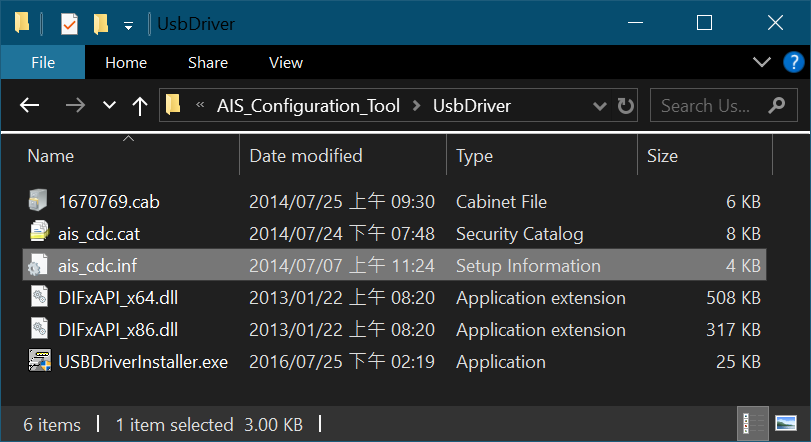
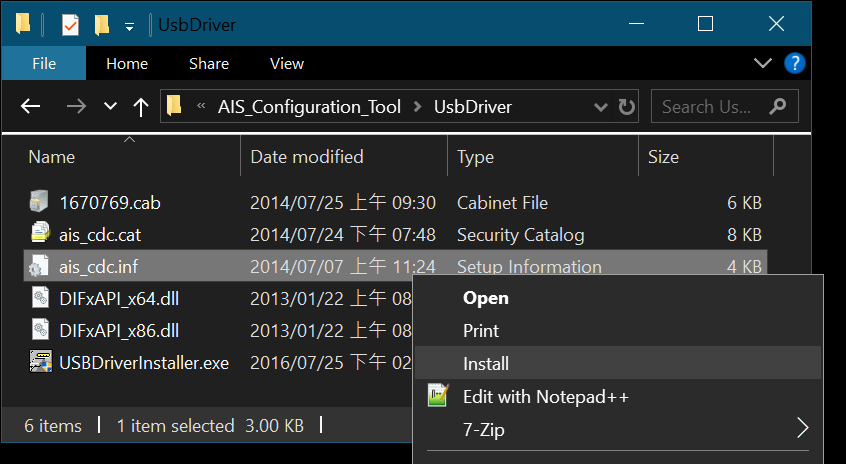

# USB Driver Installation

Download the “AIS Configuration Tool” from the AMEC website.
https://www.alltekmarine.com/en-global/support/download

Product Category, select “AIS Class B CS”

Decompress the file, the USB driver is in the following path.

Disconnect the AIS device USB connection from the PC.
Mouse right click on the .inf file, select “Install”.

